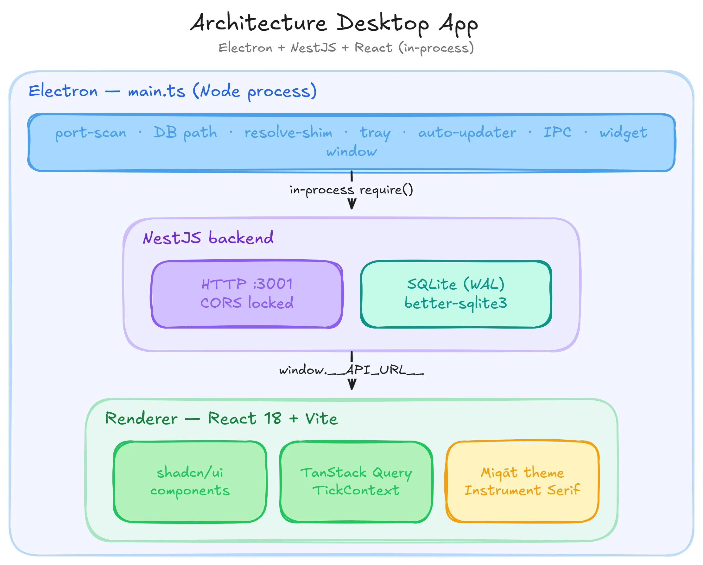

# Miqāt

> *miqāt* (ميقات) — Arabic: "an appointed time." The word names the boundaries
> between prayers, the seasons of the hajj, the moment a shadow equals its height.

A serene, local-first desktop app for prayer times, Qibla, Hijri calendar, and Athan playback. Works offline. Ships at [miqaaat.com](https://miqaaat.com).


## Features

| Feature | Details |
| --- | --- |
| Prayer times | Fajr, Sunrise, Dhuhr, Asr, Maghrib, Isha · 12/24h · live countdown |
| Offline-first | Computed locally with [`adhan`](https://www.npmjs.com/package/adhan), synced with Aladhan when online |
| Location | Geolocation + worldwide city search (Nominatim) · saved locations |
| Athan player | Four reciters (Makkah/Madina/Al-Aqsa/Egypt), Dua after Athan, volume, progress |
| Calculation | All Aladhan methods · Shafi / Maliki / Hanbali / Hanafi madhab |
| Hijri | Umm al-Qura via `Intl` (offline) · converter |
| Qibla | Bearing arrow + MapLibre map with line to Makkah |
| Themes | **Miqāt** (default) · Light · Dark · Paper |
| Notifications | Per-prayer toggles · 0/5/10/15/30 min pre-alerts · auto-launch on login |
| Kinetic identity | Wordmark rotates with the Sundial Mark and becomes the Held Note during Athan playback |
| Desktop | Tray, always-on-top widget (`?mode=widget`), auto-updater, ZIP build |
| i18n | English · Français · العربية (with RTL) |

## Brand system

Three faces, one state machine:

| State | Mark |
| --- | --- |
| Idle | **miqāt** wordmark — the macron over the ā is the horizon |
| Rotation | **Sundial Mark** — a dot on an arc, positioned by current time within today's Fajr→Isha window |
| Athan playing | **Held Note** — animated waveform that decays into stillness |

See [docs/brand.md](docs/brand.md) for the full system, palette, and typography.

## Architecture



See [docs/architecture.md](docs/architecture.md) for the data flow, in-process NestJS rationale, and theme system.

## Install

Grab the latest from [Releases](https://github.com/bdevgroup/miqaat/releases/latest).

| Platform | Asset |
| --- | --- |
| Windows 10/11 | `Miqaat-X.Y.Z-win.zip` |
| macOS 12+ Apple Silicon (M1/M2/M3/M4) | `Miqaat-X.Y.Z-arm64.dmg` |
| macOS 12+ Intel | `Miqaat-X.Y.Z-x64.dmg` |
| Linux | `Miqaat-X.Y.Z-x64.AppImage` or `Miqaat-X.Y.Z-x64.deb` |

### macOS — first-launch workaround

The macOS builds are unsigned (no Apple Developer account yet). On first launch you'll see one of these — they're all the same Gatekeeper warning:

- *"Miqaat is damaged and can't be opened"*
- *"Miqaat cannot be opened because Apple cannot check it for malicious software"*
- *"...may harm your Mac"*

Bypass with one Terminal command. Open **Terminal.app** (⌘+Space → "Terminal") and paste:

```bash
xattr -cr /Applications/Miqaat.app
```

That clears the `com.apple.quarantine` attribute Gatekeeper uses to flag downloaded apps. After this, double-clicking launches normally — and you only need to run it once per install. When Miqāt earns its Apple Developer cert, this step goes away.

### Windows — first-launch workaround

SmartScreen may show *"Windows protected your PC"* on first launch (same root cause: unsigned binary). Click **More info** → **Run anyway**.

### Linux

- AppImage: `chmod +x Miqaat-*.AppImage` then double-click.
- `.deb`: `sudo apt install ./Miqaat-*.deb`.

## Getting started

```bash
npm install
npm run dev           # NestJS :3001 + Vite :5173 + Electron
npm run fetch:audio   # download Athan MP3s to client/public/audio/
npm test              # offline tests (14)
npm run test:online   # adds 250-case Aladhan parity sweep
npm run package       # ZIP build via electron-builder
```

See [docs/getting-started.md](docs/getting-started.md) for setup, [docs/desktop-builds.md](docs/desktop-builds.md) for packaging, [docs/releasing.md](docs/releasing.md) for the release flow (one-shot bump → tag → matrix build → landing refresh), and [docs/auto-updater.md](docs/auto-updater.md) for in-app update behaviour.

## Stack

- **Backend**: NestJS 10 · SQLite (`better-sqlite3`, raw SQL) · adhan 4 · axios · luxon
- **Frontend**: React 18 · Vite 6 · TanStack Query 5 · Tailwind CSS 4 · shadcn/ui · MapLibre GL · lucide-react · zustand
- **Desktop**: Electron 34 · electron-builder (ZIP) · electron-updater

## Contributing

Issues, PRs, and translation contributions all welcome. The codebase
intentionally stays small and readable — please match the existing
style (TypeScript strict, Tailwind 4, raw SQL with prepared statements
on the server side).

If you're translating: most user-facing strings live in
[`client/src/i18n/dict.ts`](client/src/i18n/dict.ts). Add your locale
alongside `en`/`fr`/`ar` and open a PR.

## Acknowledgments

- Pair-programmed with [Claude](https://claude.com/claude-code) (Anthropic) throughout design, implementation, and review.
- Prayer-time computation: [`adhan`](https://github.com/batoulapps/adhan)
- Online verification: [Aladhan API](https://aladhan.com)
- Geocoding: [OpenStreetMap Nominatim](https://nominatim.openstreetmap.org)
- IP geolocation: [ipapi.co](https://ipapi.co)
- Map tiles: [OpenStreetMap](https://www.openstreetmap.org/copyright)
- Fonts: Instrument Serif, Inter, JetBrains Mono, Caveat, Amiri (all via [Fontsource](https://fontsource.org))
- Brand + product direction: [Develop Better Solutions](https://develop-better-solutions.com)

## License

[MIT](LICENSE) © [Develop Better Solutions](https://develop-better-solutions.com).
